# Анализ набора данных о фастфуде

## Общая информация о данных

Датасет содержит информацию о питательной ценности блюд из различных сетей фастфуда. Были выполнены следующие шаги предобработки:

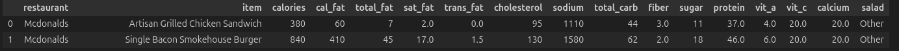

- Приведение типов данных (`float64` → `float32`, `int64` → `int32`) для экономии памяти.
- Удалена строка с индексом 127, где `calories < cal_fat` (некорректные данные, калорий больше чем калорий из жира).
- Удалён столбец `salad` (бинарный признак, не несущий никакой информации после анализа наименований).
- Удалены блюда, содержащие фразы вроде «X piece» (например, «6 piece»), чтобы исключить порционные наборы и оставить индивидуальные позиции.

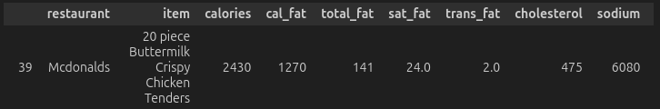
- Все названия блюд приведены к нижнему регистру.
- Добавлены производные признаки:  
  - `fat_pct = cal_fat / calories`  
  - `carb_pct = 4 * total_carb / calories`  
  - `prot_pct = 4 * protein / calories`  
  - `sugar_pct = sugar / total_carb`  
  - `healthy = ( (vit_a/med_vit_a)² + (vit_c/med_vit_c)² + (calcium/med_calcium)² ) / calories`
- Изучено, сколько блюд представляет каждый ресторан

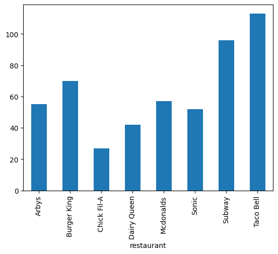

## Описательная статистика и распределения

- В данных присутствуют пропущенные значения, особенно в витаминах (`vit_a`, `vit_c`, `calcium`).
- Кажется странным, что есть колонка с калориями жира, несмотря на то, что 1г. жира принято оценивать 9 калориями. Поэтому было решено построить коробчатую диаграмму, по которой уже видно, что очень мало значений не соответсвует формуле.
- 
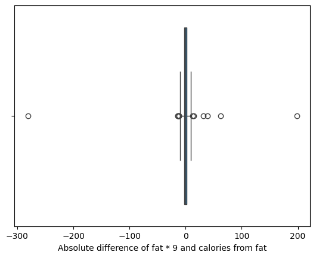
- Насыщенные жиры составляют очень большую часть от всех жиров, это плохо, потому что их чрезмерное употребление связано с повышенным риском различных заболеваний. Но это уже тема для другого исследования.
- 
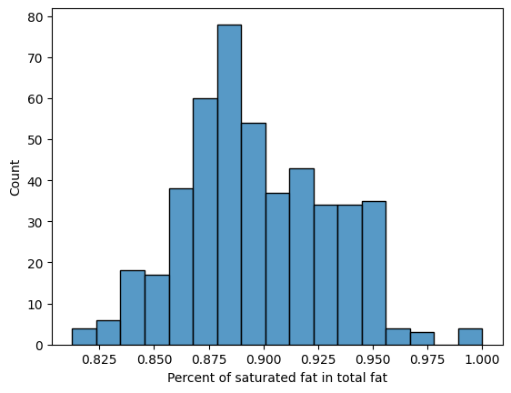
- Также проведено сравнение распределений калоража блюд в разностных фастфуд сетях через диаграмму ящик с усами. Видно что разброс блюд по калориям (ширина коробки) примерно одинаковая во всех ресторанах и медианы тоже расположены в одном районе. Для ресторана `Chick Fil-A` представлено слишком мало блюд, поэтому для него данные не очень показательны.
- 
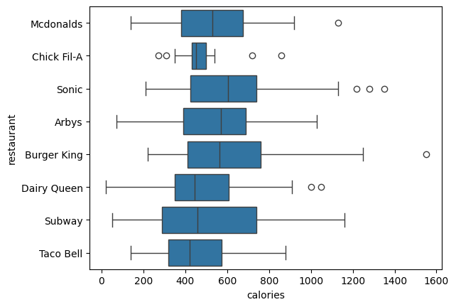
- Распределения большинства количественных признаков (например, `calories`, `cal_fat`, `sodium`) **не являются нормальными** (проверено тестами Шапиро-Уилка и D’Agostino).
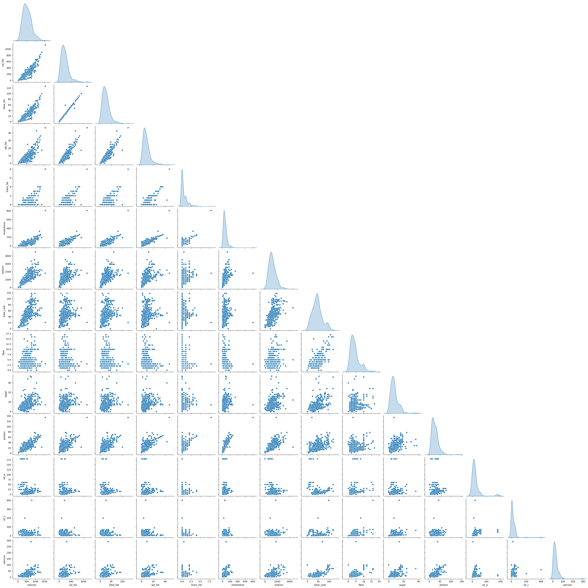
- Данные также не распределены логнормально. Проверить распределние Вейбулла не получилось.

## Корреляционный анализ

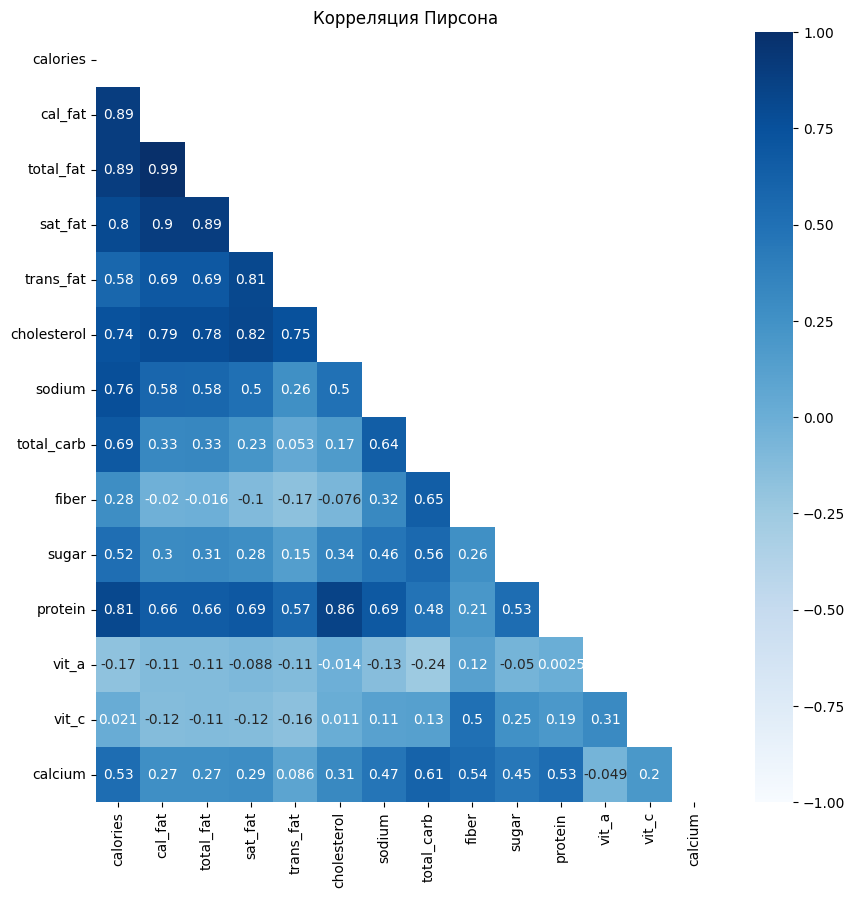
- Высокая положительная корреляция Спирмена между `calories` и `cal_fat`. Т.е. при росте калоража блюда в нем по большей части растет количество жиров.
- 
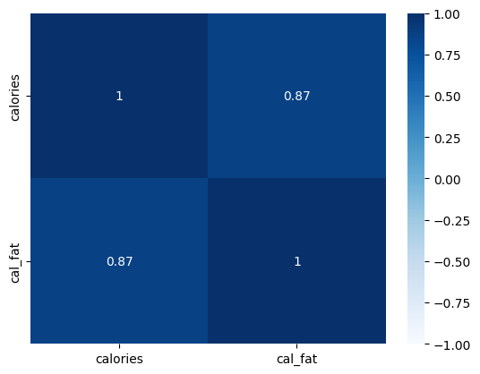
- Умеренная корреляция между `total_carb` и `sugar`, т.е. сахар не является подавляющей частью углеводов.
- 
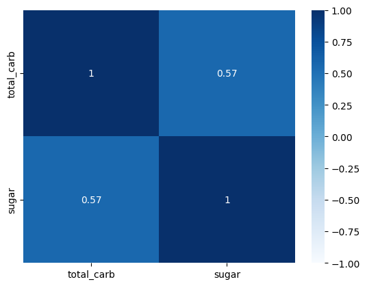
- Использованы как Пирсона, так и Спирмена (из-за отсутствия нормальности).
- Еще типа бутстрэп статистика использована для корреляции через `np.sample`, но она ничего нового не показывает.

## Анализ по сетям ресторанов

Для каждой сети построены scatter-plot зависимости содержания калорий от доли жиров, углеводов и белков, а также линейные регрессии этих показателей. Видно, что почти во всех сетях питания с ростом числа калорий растет процент жира. Например, в `Taco Bell` уровни БЖУ примерно постоянны.

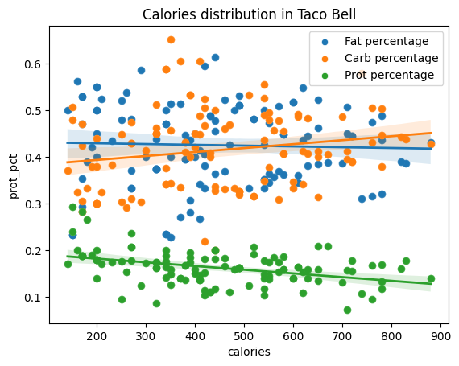

Но, мне кажется, лучше выбирать сеть, где они примерно сбалансированы, как в `Subway` и `Arbys`.

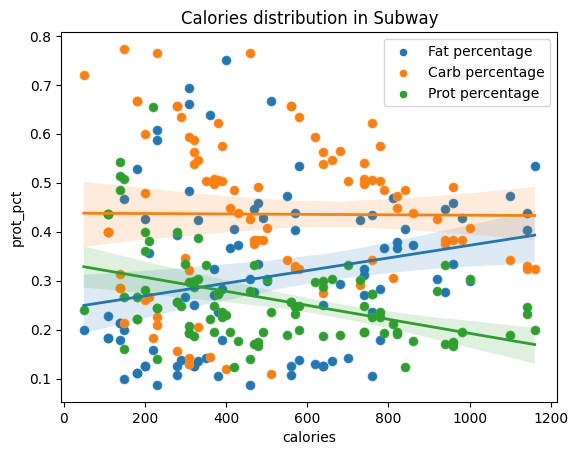

Наконец, как уже было замечено ранее, менее калорийные блюда содержат меньше жиров и больше белков и углеводов. Опять же в разных сетях уровни белки и углеводы при низкой калорийности ведут себя по разному.

## Доля салатов
  - Интересно, что среди блюд, где высока доля сахара от общего числа углеводов очень много салатов.
  
  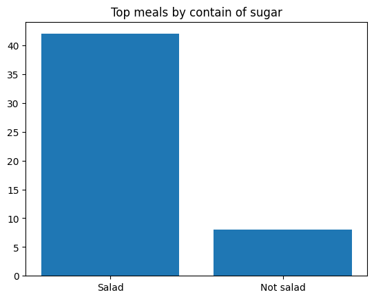
  - Определён составной показатель `healthy`, показатель уровня витаминов в продукте, нормированный на калорийность.
    - Выбраны топ-*k* самых «полезных» блюд (по убыванию `healthy`).
    - Для каждого *k* от 5 до 200 вычислена доля блюд, содержащих слово `"salad"` в названии.
    - Видно, что большую часть "витаминных" блюд составляют салаты.

    
  - Также основная часть блюд с наибольшим содержанием клетчатки - салаты.